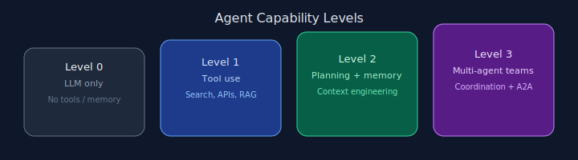

# Agentic Patterns — Companion Guide

An original, code-linked companion to the 21 agentic design patterns described in Antonio Gulli's [*Agentic Design Patterns*](https://irp.cdn-website.com/ca79032a/files/uploaded/Agentic-Design-Patterns.pdf).



## How to use this guide

Each chapter explains one pattern in plain language, shows an **original diagram** (not reproduced from the book), and links to a **runnable reference implementation** in this repository.

```bash
# Example: run Pattern 01 without API keys
python code/01_prompt_chaining/main.py
```

## Table of contents

### Introduction

- [Introduction & agent levels](./introduction.md)

### Part 1 — Foundational patterns

1. [Prompt Chaining](./part-1-foundational/01-prompt-chaining.md)
2. [Routing](./part-1-foundational/02-routing.md)
3. [Parallelization](./part-1-foundational/03-parallelization.md)
4. [Reflection](./part-1-foundational/04-reflection.md)
5. [Tool Use](./part-1-foundational/05-tool-use.md)
6. [Planning](./part-1-foundational/06-planning.md)
7. [Multi-Agent Collaboration](./part-1-foundational/07-multi-agent.md)

### Part 2 — Advanced systems

8. [Memory Management](./part-2-advanced/08-memory-management.md)
9. [Learning and Adaptation](./part-2-advanced/09-learning-adaptation.md)
10. [Model Context Protocol (MCP)](./part-2-advanced/10-mcp.md)
11. [Goal Setting and Monitoring](./part-2-advanced/11-goal-monitoring.md)

### Part 3 — Production concerns

12. [Exception Handling and Recovery](./part-3-production/12-exception-handling.md)
13. [Human-in-the-Loop](./part-3-production/13-human-in-the-loop.md)
14. [Knowledge Retrieval (RAG)](./part-3-production/14-rag.md)

### Part 4 — Multi-agent architectures

15. [Inter-Agent Communication (A2A)](./part-4-multi-agent/15-inter-agent-communication.md)
16. [Resource-Aware Optimization](./part-4-multi-agent/16-resource-optimization.md)
17. [Reasoning Techniques](./part-4-multi-agent/17-reasoning.md)
18. [Guardrails and Safety](./part-4-multi-agent/18-guardrails.md)
19. [Evaluation and Monitoring](./part-4-multi-agent/19-evaluation.md)
20. [Prioritization](./part-4-multi-agent/20-prioritization.md)
21. [Exploration and Discovery](./part-4-multi-agent/21-exploration.md)

### Appendix

- [Framework adapters (LangChain / LangGraph)](./appendix/framework-adapters.md)

## Repository

All code lives at [github.com/letslego/agentic-patterns](https://github.com/letslego/agentic-patterns).
