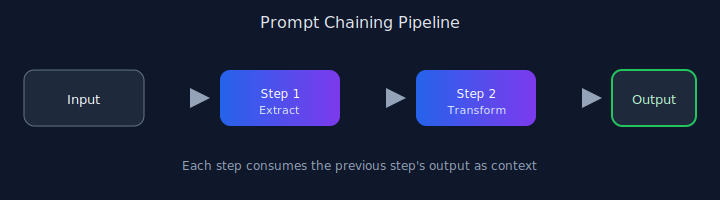

# Chapter 01: Prompt Chaining

## Pattern overview

Break complex tasks into a linear sequence of focused LLM calls. Each step consumes the previous output as context.



## Reference implementation

**Source:** [`code/01_prompt_chaining/main.py`](https://github.com/letslego/agentic-patterns/blob/main/code/01_prompt_chaining/main.py)

Split topic outline, expansion, and JSON output into three pipeline stages using `Pipeline` + `StageContext` from `agentic_patterns.kernel`.

### Run locally

```bash
python code/01_prompt_chaining/main.py
```

## Key takeaways

- Decompose before you prompt.
- Keep each step single-purpose.
- Validate intermediate outputs.

## Related patterns

See the [pattern index](../index.md).

## Further reading

- [`agentic_patterns/kernel.py`](https://github.com/letslego/agentic-patterns/blob/main/agentic_patterns/kernel.py) — pipeline primitives
- [`agentic_patterns/common.py`](https://github.com/letslego/agentic-patterns/blob/main/agentic_patterns/common.py) — shared LLM client utilities
