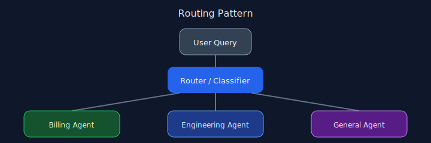

# Chapter 02: Routing

## Pattern overview

Classify incoming requests and dispatch them to specialized handlers or sub-agents.



## Reference implementation

**Source:** [`code/02_routing/main.py`](https://github.com/letslego/agentic-patterns/blob/main/code/02_routing/main.py)

A router LLM returns a label; `ROUTES` maps labels to handler callables.

### Run locally

```bash
python code/02_routing/main.py
```

## Key takeaways

- Separate classification from execution.
- Keep route labels stable.
- Log routing decisions for evaluation.

## Related patterns

See the [pattern index](../index.md).
