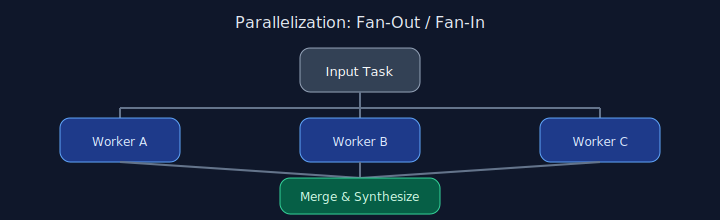

# Chapter 03: Parallelization

## Pattern overview

Execute independent subtasks concurrently, then merge results.




## Reference implementation

**Source:** [`code/03_parallelization/main.py`](https://github.com/letslego/agentic-patterns/blob/main/code/03_parallelization/main.py)

Uses `asyncio.gather` to summarize pattern descriptions in parallel before a merge step.

### Run locally

```bash
python code/03_parallelization/main.py
```

## Key takeaways

- Parallelize only truly independent work.
- Merge with a final synthesis prompt.
- Watch token and cost budgets.
