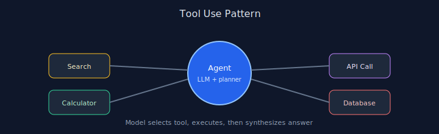

# Chapter 05: Tool Use (Function Calling)

## Pattern overview

Let the model choose external tools (APIs, calculators, search) and incorporate results.




## Reference implementation

**Source:** [`code/05_tool_use/main.py`](https://github.com/letslego/agentic-patterns/blob/main/code/05_tool_use/main.py)

Tool registry with JSON selection payload and post-tool synthesis.

### Run locally

```bash
python code/05_tool_use/main.py
```

## Key takeaways

- Tools need crisp schemas.
- Validate arguments before execution.
- Never eval untrusted code in production.
