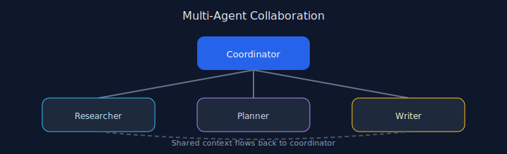

# Chapter 07: Multi-Agent Collaboration

## Pattern overview

Coordinate specialist agents through a coordinator role and shared context.



## Reference implementation

**Source:** [`code/07_multi_agent/main.py`](https://github.com/letslego/agentic-patterns/blob/main/code/07_multi_agent/main.py)

Researcher → PM outline → Writer draft → PM review pipeline.

### Run locally

```bash
python code/07_multi_agent/main.py
```

## Key takeaways

- Define roles and interfaces.
- Pass structured context between agents.
- Avoid duplicate responsibilities.
