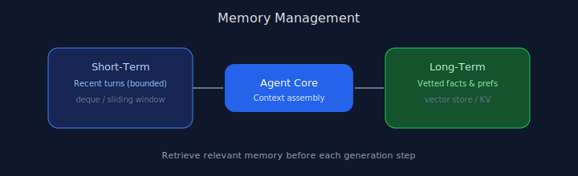

# Chapter 08: Memory Management

## Pattern overview

Combine short-term conversation buffer with persistent long-term store.




## Reference implementation

**Source:** [`code/08_memory_management/main.py`](https://github.com/letslego/agentic-patterns/blob/main/code/08_memory_management/main.py)

`EpisodicMemory` uses a deque for short-term events and a dict for long-term facts.

### Run locally

```bash
python code/08_memory_management/main.py
```

## Key takeaways

- Bound short-term memory.
- Persist only vetted facts.
- Retrieve before answering.
