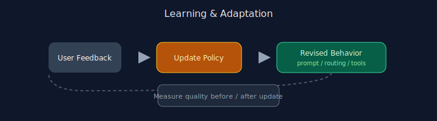

# Chapter 09: Learning and Adaptation

## Pattern overview

Update system behavior from user or evaluator feedback over time.




## Reference implementation

**Source:** [`code/09_learning_adaptation/main.py`](https://github.com/letslego/agentic-patterns/blob/main/code/09_learning_adaptation/main.py)

`AdaptiveAgent.learn_from_feedback()` rewrites its system prompt from accumulated feedback.

### Run locally

```bash
python code/09_learning_adaptation/main.py
```

## Key takeaways

- Version prompts after updates.
- Require human approval for policy changes.
- Measure before/after quality.
