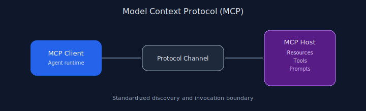

# Chapter 10: Model Context Protocol (MCP)

## Pattern overview

Standardize how agents discover resources and invoke tools via a protocol server.




## Reference implementation

**Source:** [`code/10_mcp/main.py`](https://github.com/letslego/agentic-patterns/blob/main/code/10_mcp/main.py)

Minimal capability host/client with pattern resources (`resources/read`) and lookup tools (`tools/call`).

### Run locally

```bash
python code/10_mcp/main.py
```

## Key takeaways

- Treat MCP as an integration boundary.
- Authenticate tool hosts.
- Keep handlers idempotent.
