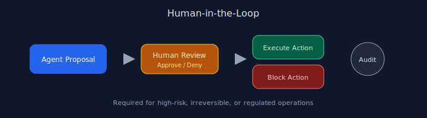

# Chapter 13: Human-in-the-Loop

## Pattern overview

Require human approval before high-impact or irreversible actions.




## Reference implementation

**Source:** [`code/13_human_in_the_loop/main.py`](https://github.com/letslego/agentic-patterns/blob/main/code/13_human_in_the_loop/main.py)

Approval gate wraps risky actions such as bulk email sends.

### Run locally

```bash
python code/13_human_in_the_loop/main.py
```

## Key takeaways

- Default deny for destructive operations.
- Show diffs to reviewers.
- Audit all decisions.
