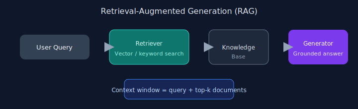

# Chapter 14: Knowledge Retrieval (RAG)

## Pattern overview

Retrieve relevant documents, inject them into context, then generate grounded answers.



## Reference implementation

**Source:** [`code/14_rag/main.py`](https://github.com/letslego/agentic-patterns/blob/main/code/14_rag/main.py)

A minimal retrieve-then-generate pipeline:

1. **Index** — chunk an inline corpus and build a vocabulary for embeddings
2. **Embed** — bag-of-words vectors for the query and each chunk
3. **Retrieve** — rank chunks by cosine similarity, take top-k
4. **Generate** — pass retrieved context to the LLM for a grounded answer

### Run locally

```bash
python code/14_rag/main.py
```

No API keys required — `get_llm()` defaults to a mock client.

## Key takeaways

- Chunk and embed thoughtfully.
- Rank by similarity before generation.
- Cite sources in answers.
- Monitor retrieval precision.
