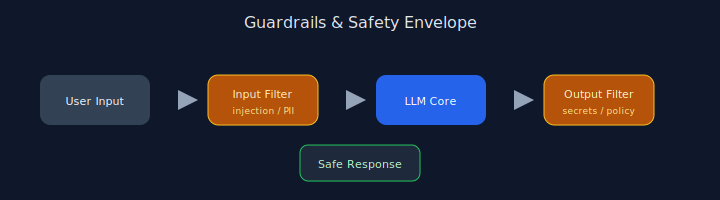

# Chapter 18: Guardrails and Safety Patterns

## Pattern overview

Validate inputs and outputs against policy before and after generation.




## Reference implementation

**Source:** [`code/18_guardrails/main.py`](https://github.com/letslego/agentic-patterns/blob/main/code/18_guardrails/main.py)

`safe_generate()` runs regex and secret-leak checks on both sides.

### Run locally

```bash
python code/18_guardrails/main.py
```

## Key takeaways

- Defense in depth.
- Block prompt injection patterns.
- Redact secrets automatically.
