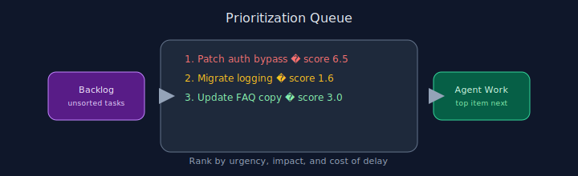

# Chapter 20: Prioritization

## Pattern overview

Rank backlog items by urgency and impact to sequence agent work.




## Reference implementation

**Source:** [`code/20_prioritization/main.py`](https://github.com/letslego/agentic-patterns/blob/main/code/20_prioritization/main.py)

Weighted score `0.6*urgency + 0.4*impact` sorts the task queue.

### Run locally

```bash
python code/20_prioritization/main.py
```

## Key takeaways

- Make tradeoffs explicit.
- Re-prioritize as context changes.
- Keep humans in the loop for edge cases.
